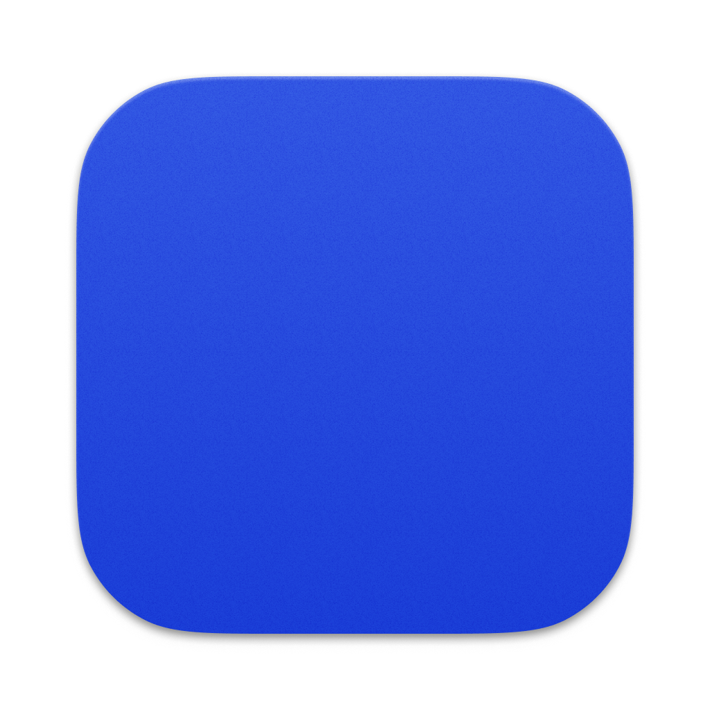

<div align="center">



# Komugi

**Your AI-powered screenshot tutor for macOS**

Take a screenshot. Ask a question. Understand the answer.

[](https://github.com/DevTRCO/Komugi/releases)
[](LICENSE.md)
[](https://tauri.app)

[Download](https://github.com/DevTRCO/Komugi/releases/latest) · [Report Bug](https://github.com/DevTRCO/Komugi/issues) · [Request Feature](https://github.com/DevTRCO/Komugi/issues)

</div>

---

Komugi is a context-aware AI tutor that lives on your desktop. Capture anything on your screen, ask about it, and get clear, Socratic explanations that help you *understand* — not just copy-paste answers.

Powered by **Google Gemini 3.1 Pro** with vision capabilities. Runs entirely local — no backend, no accounts, no tracking.

## How It Works

```
1. Press a shortcut     →  Capture your screen (fullscreen, area, or window)
2. Ask a question       →  "What does this error mean?" / "Explain this code"
3. Learn from the answer →  Socratic explanations tailored to your level
```

Every conversation starts with a screenshot. No empty chat — Komugi only exists *with* visual context.

## Features

### Screenshot Capture

Three capture modes, all triggered by customizable global shortcuts — even from fullscreen apps:

| Mode | Default Shortcut | Description |
|------|-----------------|-------------|
| Fullscreen | `Cmd+Shift+9` | Capture the entire screen |
| Area Selection | `Cmd+Shift+0` | Draw a rectangle to select a region |
| Window Selection | `Cmd+Shift+8` | Hover and click to capture a window |

### AI-Powered Explanations

- **Vision-first** — Gemini analyzes screenshots directly (code, UI, terminals, diagrams, documents)
- **Socratic teaching** — Guides you to understanding rather than handing you solutions
- **Streaming responses** — See answers appear in real-time with rich Markdown, code blocks, and LaTeX math
- **Context-aware follow-ups** — Ask multiple questions about the same screenshot

### Quick Analysis Presets

One-click analysis modes to get started fast:

| Preset | What it does |
|--------|-------------|
| **Bug Extraction** | Finds errors, console messages, visual defects, data issues |
| **Explain** | Deep explanation of whatever is on screen — code, UI, terminal output |
| **UI/UX Assessment** | Design audit covering spacing, typography, colors, and components |

### Difficulty Levels

Adjust how Komugi explains things to match your experience:

| Level | Style |
|-------|-------|
| **Beginner** | Everyday analogies, every term defined, one concept at a time |
| **Intermediate** | Technical terms with context and big-picture connections |
| **Advanced** | Deep dives into edge cases, internals, and design philosophy |

### Learning History

All sessions are saved locally in SQLite — browse past conversations, revisit explanations, and track your learning over time. Configurable retention from 0 to 365 days.

### Chat Skins

Five visual themes to match your vibe:

**Classic** · **Midnight** · **Paper** · **Sakura** · **Neon**

### 10 Languages

Komugi's interface supports English, German, French, Spanish, Portuguese, Japanese, Korean, Chinese, Hindi, and Arabic (with RTL support). AI responses automatically match your language.

## Installation

### Download

Grab the latest `.dmg` from [**GitHub Releases**](https://github.com/DevTRCO/Komugi/releases/latest), open it, and drag Komugi to your Applications folder.

### Setup

1. **Grant Screen Recording permission** — Komugi needs this to capture screenshots. On first launch, you'll be guided through the macOS permission dialog.

2. **Add your Gemini API key** — Open **Preferences** (`Cmd+,`) → **Advanced** → paste your API key. It's stored securely in the macOS Keychain.

   > Get a free API key at [aistudio.google.com](https://aistudio.google.com/apikey)

3. **Start learning** — Press `Cmd+Shift+9` to capture your screen and ask your first question.

## Keyboard Shortcuts

| Action | Shortcut |
|--------|----------|
| Fullscreen screenshot | `Cmd+Shift+9` |
| Area selection | `Cmd+Shift+0` |
| Window selection | `Cmd+Shift+8` |
| Toggle left sidebar | `Cmd+1` |
| Toggle right sidebar | `Cmd+2` |
| Preferences | `Cmd+,` |
| Show all shortcuts | `Cmd+?` |

Screenshot shortcuts are customizable in **Preferences** → **Shortcuts**.

## Tech Stack

| Layer | Technologies |
|-------|-------------|
| Desktop | [Tauri v2](https://tauri.app) (Rust + WebView) |
| Frontend | React 19, TypeScript, Tailwind CSS v4 |
| UI | [shadcn/ui](https://ui.shadcn.com) v4, Lucide React |
| State | Zustand v5, TanStack Query v5 |
| AI | Google Gemini 3.1 Pro (vision + reasoning) |
| Storage | SQLite (local learning history) |

## Development

```bash
# Prerequisites: Node.js 20+, Rust (latest stable)
# See https://tauri.app/start/prerequisites/ for macOS-specific deps

git clone https://github.com/DevTRCO/Komugi.git
cd Komugi
npm install
npm run tauri:dev
```

### Useful Commands

```bash
npm run tauri:dev      # Run the app in development mode
npm run tauri:build    # Production build (.dmg)
npm run check:all      # Full quality gate (TypeScript, ESLint, Prettier, clippy, tests)
npm run test:run       # Run frontend tests
npm run rust:test      # Run Rust tests
```

## Privacy

Komugi runs entirely on your machine. Screenshots and conversations are stored locally in SQLite. The only external connection is to the Google Gemini API — your API key is stored in the macOS Keychain, never in plain text.

No telemetry. No analytics. No accounts. No data leaves your machine except the API calls you initiate.

## License

[MIT](LICENSE.md) — Copyright (c) 2025 Tran Consulting UG

---

<div align="center">

Built with [Tauri](https://tauri.app) · [React](https://react.dev) · [Gemini](https://ai.google.dev)

</div>
